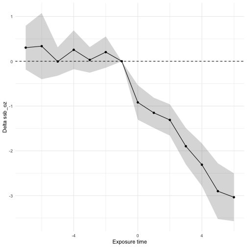
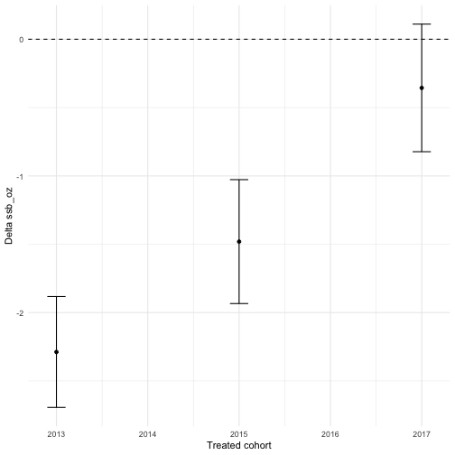
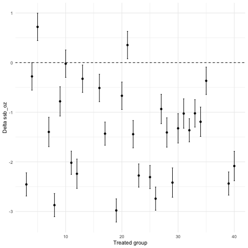

<!--
To regenerate rflexdid_demo.md (the GitHub-rendered version) after editing:

    Rscript -e 'devtools::install(quiet=TRUE); setwd("vignettes"); knitr::knit("rflexdid_demo.Rmd", output = "rflexdid_demo.md")'

Run from the package root. devtools::install() is required so that
system.file("extdata", ..., package = "rflexdid") resolves correctly.
Then commit rflexdid_demo.md and figure/ alongside this file.
-->


# Demonstrating rflexdid on simulated data

## The simulated dataset

The script `simulate_data.R` builds a repeated cross section of 20,000
adults surveyed across 40 counties over 10 years (2010–2019). Each year
brings a fresh sample of 50 individuals per county; no individual is
followed across time. Counties enact a sugar-sweetened-beverage (SSB)
excise tax in different years (the staggered cohorts: 2013, 2015, 2017,
plus a never-treated cohort labeled `0`). The outcome, `ssb_oz`, is daily SSB
consumption in fluid ounces.

The data-generating process imposes strict parallel pre-trends and known
treatment effects: an immediate jump `alpha_g` (-1.5 oz/day for the 2013
cohort, -1.0 for 2015, -0.5 for 2017) plus a smooth dynamic decline
`-0.20 e - 0.02 e^2` in event time `e`. So early-cohort counties
enacted larger taxes, and consumption keeps falling with longer exposure.


``` r
library(rflexdid)
library(ggplot2)
library(fixest)
df <- read.csv(system.file("extdata", "example_data.csv", package = "rflexdid"))
head(df)
```

```
##   county year cohort treated      age female    region    ssb_oz
## 1      1 2010      0       0 25.60111      0      West 10.234163
## 2      2 2010      0       0 18.00000      1 Northeast  8.330653
## 3      3 2010   2013       0 38.73399      1 Northeast 14.632594
## 4      4 2010   2017       0 41.52287      1 Northeast  4.069476
## 5      5 2010   2017       0 21.34340      1     South 12.341625
## 6      6 2010      0       0 56.52613      0      West 16.259764
```

``` r
table(df$cohort)
```

```
## 
##    0 2013 2015 2017 
## 5000 5000 5000 5000
```

## Estimation

`flexdid()` runs a single OLS regression of `ssb_oz` on a saturated set
of cohort × group × time × treatment interactions. County and year
fixed effects are absorbed automatically. `specification = "lagsandleads"`
adds pre-treatment lead indicators so parallel pre-trends are visually
testable. Standard errors cluster at the county level. The right-hand
side `~ 1` here means no covariates; we add one in the
[Including covariates](#including-covariates) section.


``` r
fit <- flexdid(ssb_oz ~ 1,
               data = df,
               tx = "treated",
               group = "county",
               time = "year",
               specification = "lagsandleads",
               vcov = "cluster",
               cluster = "county")

fit
```

```
## Flexible difference-in-differences regression
##   Specification: lagsandleads 
##   Outcome:       ssb_oz 
##   Treatment:     treated  | Group: county  | Time: year 
##   Observations:  20000 
##   VCE:           cluster (county; 40 clusters)
##   R-squared:     0.1470   (adj. 0.1332)
```

## Overall ATET

A single number that averages cell-level effects across all
post-treatment observations. The DGP-implied truth (the mean of `tau`
over treated rows, using the same formula as `simulate_data.R`):


``` r
alpha_g <- c(`2013` = -1.5, `2015` = -1.0, `2017` = -0.5, `0` = 0)
e <- df$year - df$cohort
tau_true <- ifelse(df$treated == 1,
                   alpha_g[as.character(df$cohort)] - 0.20 * e - 0.02 * e^2,
                   0)
mean(tau_true[df$treated == 1])
```

```
## [1] -1.754667
```

The flexdid estimate should be close:


``` r
atet(fit, type = "overall")
```

```
## Overall ATET
## Observations: 20000 | ATET sample: 7500
## Aggregation weight: obslevel
## 
##         Estimate Std. Error t value Pr(>|t|) [CI lo] [CI hi]
## Overall -1.6325   0.1882    -8.6762  0.0000  -2.0013 -1.2637
```

## Comparison to TWFE

For reference, the canonical two-way fixed-effects (TWFE) estimator
regresses the outcome on a single dummy for treatment, with group and
time fixed effects:


``` r
twfe <- feols(ssb_oz ~ treated | county + year,
              data = df,
              cluster = ~ county)

twfe
```

```
## OLS estimation, Dep. Var.: ssb_oz
## Observations: 20,000
## Fixed-effects: county: 40,  year: 10
## Standard-errors: Clustered (county) 
##         Estimate Std. Error  t value  Pr(>|t|)    
## treated -1.18174    0.12211 -9.67768 6.418e-12 ***
## ---
## Signif. codes:  0 '***' 0.001 '**' 0.01 '*' 0.05 '.' 0.1 ' ' 1
## RMSE: 3.16253     Adj. R2: 0.120942
##                 Within R2: 0.01062
```

The TWFE coefficient on `treated` is noticeably attenuated relative to
the flexdid overall ATET above. This is the canonical
Goodman-Bacon (2021) result: under staggered treatment timing with
dynamic effects, TWFE puts negative weight on "forbidden comparisons"
in which already-treated units serve as controls for later-treated
cohorts. When effects intensify with exposure, those negative-weighted
2 × 2 contrasts pull the estimate toward zero. The `flexdid` design
sidesteps the problem by estimating each cohort × group × time cell
separately and then aggregating only legitimate comparisons.

## Including covariates

Putting a continuous covariate on the right-hand side of the formula
interacts it with every cohort × group × time cell — it allows the
treatment effect to vary with the covariate and absorbs residual
variance for tighter standard errors. In this DGP age does not moderate
treatment, so the overall ATET barely moves; the standard error tightens
slightly:


``` r
fit_age <- flexdid(ssb_oz ~ age,
                   data = df,
                   tx = "treated",
                   group = "county",
                   time = "year",
                   specification = "lagsandleads",
                   vcov = "cluster",
                   cluster = "county")

atet(fit_age, type = "overall")
```

```
## Overall ATET
## Observations: 20000 | ATET sample: 7500
## Aggregation weight: obslevel
## 
##         Estimate Std. Error t value Pr(>|t|) [CI lo] [CI hi]
## Overall -1.5979   0.1863    -8.5779  0.0000  -1.9630 -1.2328
```

The remaining sections continue to use the baseline (`fit`, no
covariates) for clarity.

## Event study (`byexposure`)

The most useful diagnostic. Pre-period estimates (event time `e < 0`)
should be statistically indistinguishable from zero; post-period
estimates should grow more negative with exposure time, tracing out the
dynamic profile of the tax's effect. The base period `e = -1` is
mechanically zero with SE = 0.


``` r
ax <- atet(fit, type = "byexposure", test = "zero")
ax
```

```
## ATET by exposure time
## Observations: 20000 | ATET sample: 15000
## Aggregation weight: obslevel
## 
##    Estimate Std. Error t value  Pr(>|t|) [CI lo]  [CI hi] 
## -7  0.3039   0.2493     1.2192   0.2228  -0.1847   0.7926 
## -6  0.3371   0.3767     0.8950   0.3708  -0.4012   1.0754 
## -5 -0.0052   0.1619    -0.0322   0.9743  -0.3227   0.3122 
## -4  0.2557   0.2208     1.1580   0.2469  -0.1771   0.6885 
## -3  0.0302   0.1457     0.2075   0.8356  -0.2554   0.3158 
## -2  0.2044   0.1781     1.1478   0.2511  -0.1447   0.5536 
## -1  0.0000   0.0000          NA       NA       NA       NA
## 0  -0.9187   0.1965    -4.6743   0.0000  -1.3039  -0.5335 
## 1  -1.1513   0.1720    -6.6924   0.0000  -1.4885  -0.8141 
## 2  -1.3100   0.1785    -7.3401   0.0000  -1.6598  -0.9602 
## 3  -1.8970   0.2074    -9.1472   0.0000  -2.3035  -1.4905 
## 4  -2.3088   0.2429    -9.5040   0.0000  -2.7849  -1.8326 
## 5  -2.9005   0.3173    -9.1412   0.0000  -3.5225  -2.2786 
## 6  -3.0355   0.2726    -11.1340  0.0000  -3.5699  -2.5011 
## 
## Test of zero ATETs
##   H0: All effects are equal to zero
##   F(13, 19681) = 29.902   Prob > F = 0.0000
```

``` r
plot(ax)
```



The Wald test rejects the joint hypothesis that all event-time effects
are zero.

## By treated cohort

Each treated cohort gets one ATET, averaging that cohort's
post-treatment cell effects. The estimates should rank
2013 (most negative) > 2015 > 2017 (least negative), mirroring the tax
magnitudes baked into the DGP.


``` r
acoh <- atet(fit, type = "bycohort")
acoh
```

```
## ATET by treated cohort
## Observations: 20000 | ATET sample: 7500
## Aggregation weight: obslevel
## 
##      Estimate Std. Error t value  Pr(>|t|) [CI lo] [CI hi]
## 2013 -2.2881   0.2069    -11.0580  0.0000  -2.6936 -1.8825
## 2015 -1.4806   0.2313    -6.4019   0.0000  -1.9339 -1.0272
## 2017 -0.3561   0.2381    -1.4953   0.1348  -0.8228  0.1107
```

``` r
plot(acoh)
```



## By calendar time

A separate ATET for each calendar year, averaging across whichever
cohorts were already post-treatment in that year. Effects start near
zero in 2010–2012 (no cohort treated yet), turn negative in 2013
(2013 cohort enters), and grow more negative as the 2015 and 2017
cohorts roll in.


``` r
acal <- atet(fit, type = "bycalendar")
acal
```

```
## ATET by calendar time
## Observations: 20000 | ATET sample: 13500
## Aggregation weight: obslevel
## 
##      Estimate Std. Error t value Pr(>|t|) [CI lo] [CI hi]
## 2010  0.1864   0.1611     1.1569  0.2473  -0.1294  0.5023
## 2011  0.3689   0.2426     1.5209  0.1283  -0.1065  0.8443
## 2012 -0.2093   0.1795    -1.1657  0.2437  -0.5611  0.1426
## 2013 -0.5006   0.2655    -1.8857  0.0594  -1.0209  0.0198
## 2014 -0.7330   0.3080    -2.3801  0.0173  -1.3367 -0.1293
## 2015 -0.8053   0.2274    -3.5408  0.0004  -1.2511 -0.3595
## 2016 -1.8413   0.1972    -9.3377  0.0000  -2.2278 -1.4548
## 2017 -1.5573   0.2654    -5.8677  0.0000  -2.0775 -1.0371
## 2018 -1.5855   0.2830    -5.6031  0.0000  -2.1401 -1.0308
## 2019 -1.7981   0.2770    -6.4912  0.0000  -2.3411 -1.2552
```

``` r
plot(acal)
```


## By treated group (county)

A separate ATET for each treated county. Useful for spotting outlier
counties or for inspecting the within-cohort dispersion.


``` r
agrp <- atet(fit, type = "bygroup")
plot(agrp)
```



## Group × event time (`byget`)

The most disaggregated view: one ATET per (county, event time) pair.
Restricting `values = 0:3` keeps the table readable.


``` r
aget <- atet(fit, type = "byget", values = 0:3)
head(as.data.frame(aget), 12)
```

```
##     label    Estimate Std. Error     t value     Pr(>|t|)       [CI lo]
## 1  g3|et0 -1.20847035  0.1813006  -6.6655605 2.706438e-11 -1.5638349192
## 2  g3|et1 -1.89108086  0.1778084 -10.6354960 2.402338e-26 -2.2396004111
## 3  g3|et2 -1.61524325  0.1130508 -14.2877681 4.435297e-46 -1.8368323285
## 4  g3|et3 -2.70388137  0.1467272 -18.4279477 3.365081e-75 -2.9914791063
## 5  g4|et0 -0.47651770  0.1445281  -3.2970598 9.787574e-04 -0.7598049450
## 6  g4|et1 -0.42904170  0.1458502  -2.9416601 3.268384e-03 -0.7149204113
## 7  g4|et2  0.07151653  0.2092706   0.3417418 7.325488e-01 -0.3386716049
## 8  g5|et0  1.04350167  0.1445281   7.2200621 5.385622e-13  0.7602144268
## 9  g5|et1  0.70776934  0.1458502   4.8527144 1.227154e-06  0.4218906292
## 10 g5|et2  0.41048103  0.2092706   1.9614841 4.983665e-02  0.0002928971
## 11 g7|et0 -0.88458046  0.1798005  -4.9197895 8.733675e-07 -1.2370045774
## 12 g7|et1 -1.34265963  0.1992974  -6.7369666 1.661979e-11 -1.7332992945
##       [CI hi]
## 1  -0.8531058
## 2  -1.5425613
## 3  -1.3936542
## 4  -2.4162836
## 5  -0.1932305
## 6  -0.1431630
## 7   0.4817047
## 8   1.3267889
## 9   0.9936480
## 10  0.8206692
## 11 -0.5321563
## 12 -0.9520200
```

## Subgroup ATET via `for_expr`

Restrict the population over which the ATET is averaged. This is the
analogue of Stata's `for(female == 1)` option. The subgroup estimate
should be close to the overall estimate, since the DGP doesn't make
treatment effects depend on sex.


``` r
atet(fit, type = "byexposure", for_expr = ~ female == 1)
```

```
## ATET by exposure time for `~female == 1`
## Observations: 20000 | ATET sample: 7454
## Aggregation weight: obslevel
## 
##    Estimate Std. Error t value  Pr(>|t|) [CI lo]  [CI hi] 
## -7  0.2790   0.2468     1.1306   0.2582  -0.2047   0.7628 
## -6  0.3474   0.3726     0.9326   0.3510  -0.3828   1.0777 
## -5 -0.0180   0.1610    -0.1116   0.9112  -0.3336   0.2977 
## -4  0.2353   0.2199     1.0699   0.2847  -0.1958   0.6664 
## -3  0.0205   0.1458     0.1407   0.8881  -0.2653   0.3063 
## -2  0.1706   0.1822     0.9365   0.3490  -0.1865   0.5278 
## -1  0.0000   0.0000          NA       NA       NA       NA
## 0  -0.9115   0.1978    -4.6072   0.0000  -1.2993  -0.5237 
## 1  -1.1795   0.1713    -6.8846   0.0000  -1.5153  -0.8437 
## 2  -1.3023   0.1857    -7.0120   0.0000  -1.6663  -0.9382 
## 3  -1.9094   0.2060    -9.2696   0.0000  -2.3131  -1.5056 
## 4  -2.3654   0.2477    -9.5490   0.0000  -2.8509  -1.8799 
## 5  -2.9158   0.3151    -9.2527   0.0000  -3.5335  -2.2981 
## 6  -3.0864   0.2591    -11.9132  0.0000  -3.5942  -2.5786
```

## Non-interacted controls (`xnotinteracted`)

`xnotinteracted` adds additive controls that are not interacted with the
treatment-cell indicators — useful for absorbing variance from
group-level covariates without inflating the parameter count. Region is
constant within county, so it slots in cleanly here.


``` r
fit2 <- flexdid(ssb_oz ~ 1,
                data = df,
                tx = "treated",
                group = "county",
                time = "year",
                specification = "lagsandleads",
                xnotinteracted = ~ region,
                vcov = "cluster",
                cluster = "county")

atet(fit2, type = "overall")
```

```
## Overall ATET
## Observations: 20000 | ATET sample: 7500
## Aggregation weight: obslevel
## 
##         Estimate Std. Error t value Pr(>|t|) [CI lo] [CI hi]
## Overall -1.6325   0.1882    -8.6762  0.0000  -2.0013 -1.2637
```

## Group-level aggregation weights

`aggregationweight = "grouplevel"` reweights cells so that each county
contributes equally to the ATET, regardless of cell size. In this
simulation every county has exactly 500 observations, so the result
matches the default `obslevel` weighting; with unbalanced cell sizes
the two would differ.


``` r
atet(fit, type = "overall", aggregationweight = "grouplevel")
```

```
## Overall ATET
## Observations: 20000 | ATET sample: 7500
## Aggregation weight: grouplevel
## 
##         Estimate Std. Error t value Pr(>|t|) [CI lo] [CI hi]
## Overall -1.6325   0.1882    -8.6762  0.0000  -2.0013 -1.2637
```

## Wald test of homogeneity

`test = "equal"` tests the null hypothesis that all event-time effects
are equal — i.e., that the dynamic profile is flat. The DGP makes
effects strictly increase in exposure, so the test should reject.


``` r
atet(fit, type = "byexposure", test = "equal")
```

```
## ATET by exposure time
## Observations: 20000 | ATET sample: 15000
## Aggregation weight: obslevel
## 
##    Estimate Std. Error t value  Pr(>|t|) [CI lo]  [CI hi] 
## -7  0.3039   0.2493     1.2192   0.2228  -0.1847   0.7926 
## -6  0.3371   0.3767     0.8950   0.3708  -0.4012   1.0754 
## -5 -0.0052   0.1619    -0.0322   0.9743  -0.3227   0.3122 
## -4  0.2557   0.2208     1.1580   0.2469  -0.1771   0.6885 
## -3  0.0302   0.1457     0.2075   0.8356  -0.2554   0.3158 
## -2  0.2044   0.1781     1.1478   0.2511  -0.1447   0.5536 
## -1  0.0000   0.0000          NA       NA       NA       NA
## 0  -0.9187   0.1965    -4.6743   0.0000  -1.3039  -0.5335 
## 1  -1.1513   0.1720    -6.6924   0.0000  -1.4885  -0.8141 
## 2  -1.3100   0.1785    -7.3401   0.0000  -1.6598  -0.9602 
## 3  -1.8970   0.2074    -9.1472   0.0000  -2.3035  -1.4905 
## 4  -2.3088   0.2429    -9.5040   0.0000  -2.7849  -1.8326 
## 5  -2.9005   0.3173    -9.1412   0.0000  -3.5225  -2.2786 
## 6  -3.0355   0.2726    -11.1340  0.0000  -3.5699  -2.5011 
## 
## Test of equal ATETs
##   H0: Effects are equal to each other
##   F(12, 19681) = 29.224   Prob > F = 0.0000
```
